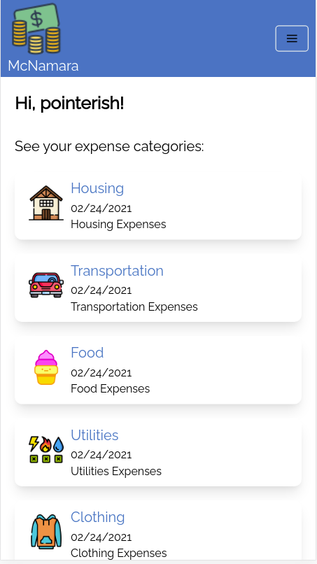
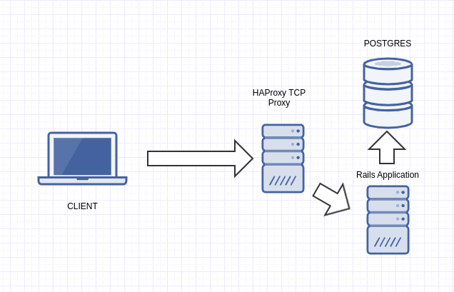
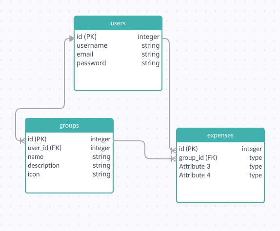

#  McNamara

> McNamara is an expense tracker web application built with Rails, PostgreSQL and Docker that aides its user to track expenses and expense categories.

<br>
<p align="center">
  
</p>
<br>

## Built With

- Ruby v2.7.0
- Ruby on Rails v6.1.3
- PostgreSQL:latest

## Live Demo

https://cutt.ly/RlRU9ka

## Getting Started

To get a local copy up and running follow the next steps:

- Get the repository by either cloning or Zip download
- Install gems with `bundle install`
- Setup database with `bin/rails db:migrate`. Keep in mind that you need to setup Postgres by installing it or by running it inside a Docker instance.

### Usage

Start server with:

```
bin/rails server
```

Open `http://localhost:3000/` in your browser.

### Run tests

```
rspec
```

### Deployment

The live version was deployed to a server running Ubuntu 20.04 with the following architecture where the PostgreSQL DB and the Rails Application run inside a Docker container.



<br/><br/>
The PostgreSQL DB has the following schema:




## Author

👤 **Josias Alvarado**

- GitHub: [@pointerish](https://github.com/pointerish)
- Twitter: [@pointerish](https://twitter.com/pointerish)
- LinkedIn: [LinkedIn](https://www.linkedin.com/in/josias-alvarado/)

## Contributing

Contributions, issues, and feature requests are welcome!

Feel free to check the [issues page](https://github.com/pointerish/ror-social-scaffold/issues).

## Show your support

Give a ⭐️ if you like this project!

## Acknowledgments

- [The Odin Project](https://www.theodinproject.com/)
- [Microverse](https://microverse.org)
- [My brain](https://josias-alvarado.me)

## License

This project is [MIT](LICENSE) licensed.
